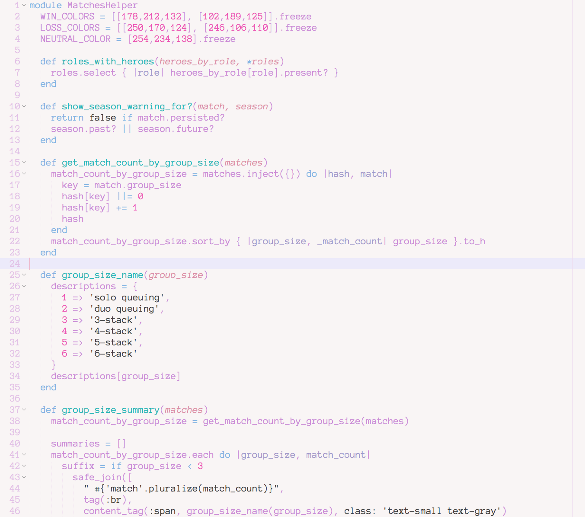

# \~ soft era \~

### syntax theme for [Sublime Text](https://www.sublimetext.com/)

🌸 Light pastel syntax theme for soft, warm, cozy, cute coding. 🌱

   ⚠️🚧🚧🚧🚧⚠️  
awaiting pull request from a noble soul who wants to port this <3
  ⚠️🚧🚧🚧🚧⚠️    

\~.\~
 &nbsp;&nbsp;a soft, warm, low contrast theme,
 &nbsp;&nbsp;with pastel accents that are easy on your eyes

^.^
 &nbsp;&nbsp;make stuff and learn.
 &nbsp;&nbsp;make the world your kinda place.
 &nbsp;&nbsp;take care of the people around you

🌿

## Installation

- In Sublime Text, go to Preferences > Browse Packages...
- If there is no `User` directory, create one
- Inside `User`, navigate to or create a `Color Schemes` directory
- Copy `Soft Era.tmTheme` into `Color Schemes`
- In Sublime Text, go to Preferences > Color Scheme...
- Choose "Soft Era" as your color scheme

💾 enjoy <3

---

Happy to hear any input <3

💖 [@animalphase](https://twitter.com/animalphase) on twitter
